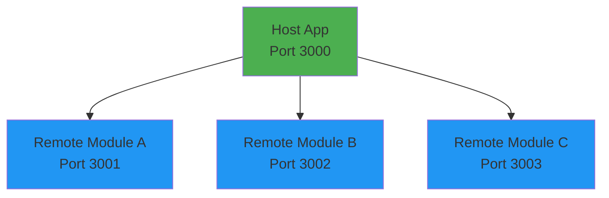
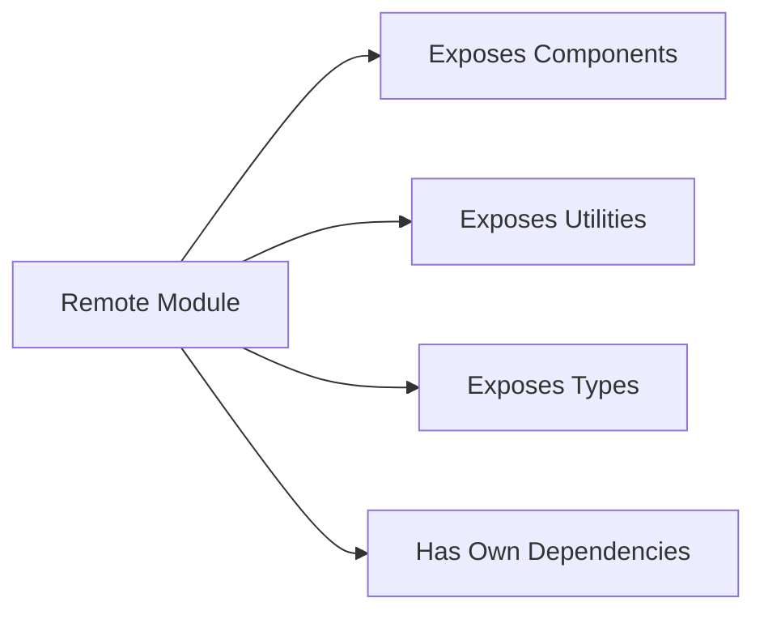
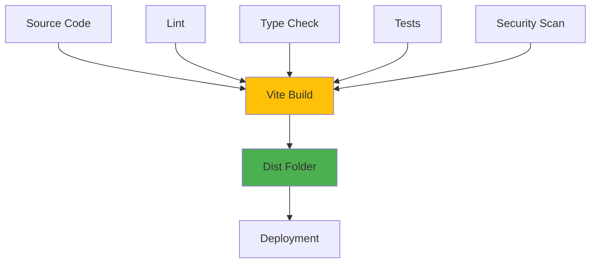
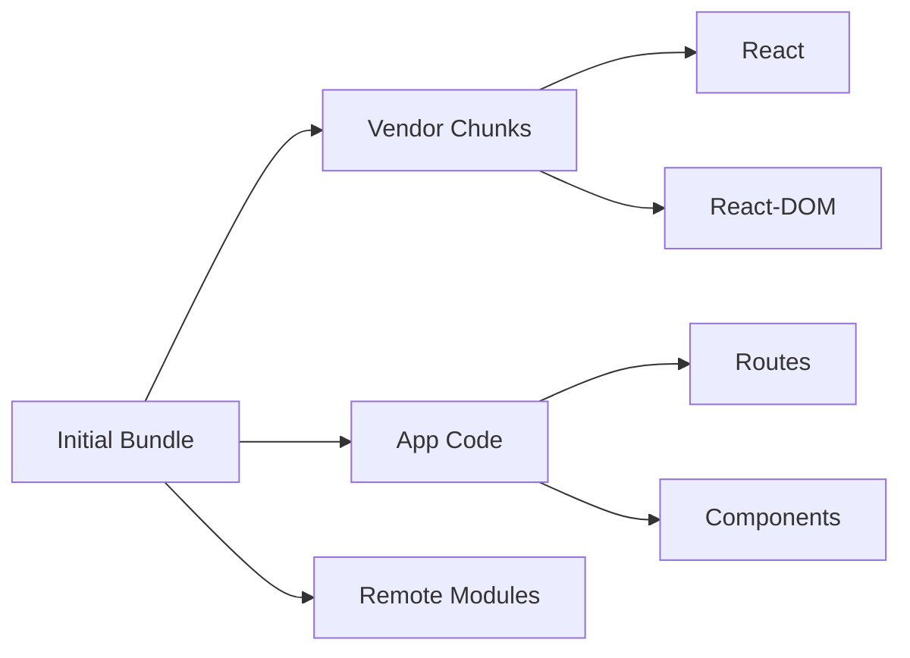

# Architecture Documentation

> **Note**: This document provides detailed implementation patterns and technical specifics for AI-assisted development. For a high-level architecture overview, see [ARCHITECTURE.md](../ARCHITECTURE.md).

## System Overview

This document describes the architecture for modern frontend applications built with TypeScript, React 18+, Vite, and Module Federation for microfrontend architecture.

## Module Federation Architecture

### Overview

We use **Module Federation** to create microfrontend architectures where independent applications can share code at runtime. This enables:

- Independent deployment of frontend modules
- Code sharing and deduplication
- Team autonomy and parallel development
- Dynamic loading of remote modules

### Version Support

We support **both Module Federation v1 and v2** via the Vite plugin `@originjs/vite-plugin-federation` to ensure compatibility with existing systems while enabling modern capabilities.

#### V1 - Classic Module Federation

```typescript
// Exposes modules in standard MF pattern
federation({
  name: 'host_app',
  remotes: {
    'remote_app': 'http://localhost:3001/remoteEntry.js',
  },
})
```

#### V2 - Enhanced Module Federation

```typescript
// Advanced features: shared context, better type safety
federation({
  name: 'host_app',
  remotes: {
    'remote_app': {
      external: 'http://localhost:3001/remoteEntry.js',
      shareScope: 'default',
    },
  },
})
```

### Host Application

The **host application** orchestrates and consumes remote modules:



**Responsibilities:**

- Routes between remote modules
- Provides shared context/state (if using React Context across federated modules)
- Loads remote entry points
- Manages authentication/session state
- Handles global UI (navigation, headers, footers)

**Type Safety:**

- Declare remote module types explicitly
- Use type imports for remote components
- Create type definitions for federated modules

Example:

```typescript
// types/remote-modules.d.ts
declare module 'remote_app/Button' {
  export interface ButtonProps {
    children: React.ReactNode
    onClick?: () => void
    variant?: 'primary' | 'secondary'
  }
  export const Button: React.FC<ButtonProps>
}

// usage
import type { ButtonProps } from 'remote_app/Button'
import { Button } from 'remote_app/Button'
```

### Remote Modules

**Remote modules** expose components and utilities to host applications:



**Responsibilities:**

- Export public API (components, hooks, utilities)
- Handle internal state management
- Can be deployed independently
- Own their dependencies (can share via federated dependencies)

**Exposing Modules:**

```typescript
// vite.config.ts
export default defineConfig({
  plugins: [
    federation({
      name: 'remote_app',
      filename: 'remoteEntry.js',
      exposes: {
        './Button': './src/components/Button',
        './utils': './src/utils',
      },
      shared: {
        react: { singleton: true, requiredVersion: '^18.0.0' },
        'react-dom': { singleton: true, requiredVersion: '^18.0.0' },
      },
    }),
  ],
})
```

### Shared Dependencies

**Shared dependencies** prevent duplication across federated modules:

```typescript
shared: {
  'react': {
    singleton: true,        // Only one instance
    requiredVersion: '^18.0.0',
    eager: false,          // Lazy load if not used immediately
  },
  'react-dom': {
    singleton: true,
    requiredVersion: '^18.0.0',
  },
  'lodash': {
    requiredVersion: '^4.17.21',
    // Not singleton - each module can have its own version
  },
}
```

**Best Practices:**

- Share major frameworks (React, React-DOM) as singletons
- Consider sharing UI libraries if bundle size is a concern
- Don't share business logic that needs versioning flexibility
- Use `eager: false` for most shared dependencies to enable code splitting

## State Management Strategy

### Local Component State

Use `useState` and `useReducer` for component-local state:

```typescript
const [count, setCount] = useState(0)

// Prefer useReducer for complex state
const [state, dispatch] = useReducer(reducer, initialState)
```

### Cross-Component State

**React Context** for theme, auth, user preferences:

```typescript
// Context should be split by domain
const ThemeContext = createContext<Theme>(...)
const AuthContext = createContext<AuthState>(...)
```

**Rules:**

- Don't put frequently changing values in Context (causes re-renders)
- Split contexts by domain/concern
- Use Context + Provider pattern
- Consider `use-context-selector` for performance-critical contexts

### Global Application State

For complex global state, consider:

1. **Zustand** - Simple, no boilerplate
   - Best for: Medium complexity, TypeScript-first
   - Good performance, devtools support

2. **Jotai** - Atomic state management
   - Best for: Fine-grained reactivity
   - Excellent for complex UIs

3. **Redux Toolkit** - Established solution
   - Best for: Complex applications, needs predictable updates
   - When: Team familiar with Redux patterns

**Recommendation:** Start with React state + Context, upgrade to Zustand/Jotai when needed.

## Routing Architecture

### Routing Strategy

Use **React Router v6+** for client-side routing:

```typescript
import { BrowserRouter, Routes, Route, Navigate } from 'react-router-dom'

function App() {
  return (
    <BrowserRouter>
      <Routes>
        <Route path="/" element={<Home />} />
        <Route path="/about" element={<About />} />
        <Route path="/products/*" element={<ProductsRouter />} />
        <Route path="*" element={<NotFound />} />
      </Routes>
    </BrowserRouter>
  )
}
```

### Code Splitting with Routes

Lazy load routes for better performance:

```typescript
const Products = lazy(() => import('./pages/Products'))
const About = lazy(() => import('./pages/About'))

function App() {
  return (
    <Suspense fallback={<LoadingSpinner />}>
      <Routes>
        <Route path="/products" element={<Products />} />
      </Routes>
    </Suspense>
  )
}
```

### Protected Routes

Implement authentication guards:

```typescript
function ProtectedRoute({ children }: { children: React.ReactNode }) {
  const { user, isLoading } = useAuth()
  
  if (isLoading) return <LoadingSpinner />
  if (!user) return <Navigate to="/login" replace />
  
  return <>{children}</>
}
```

## API Integration Patterns

### API Client Strategy

Create typed API clients:

```typescript
// services/api/client.ts
export const apiClient = axios.create({
  baseURL: import.meta.env.VITE_API_URL,
  headers: { 'Content-Type': 'application/json' },
})

// Add interceptors for auth, error handling
apiClient.interceptors.request.use(addAuthToken)
apiClient.interceptors.response.use(handleSuccess, handleError)
```

### Type-Safe API Calls

```typescript
// services/users.ts
export interface User {
  id: string
  name: string
  email: string
}

export async function fetchUser(id: string): Promise<User> {
  const response = await apiClient.get<User>(`/users/${id}`)
  return response.data
}

export async function createUser(data: Omit<User, 'id'>): Promise<User> {
  const response = await apiClient.post<User>('/users', data)
  return response.data
}
```

### Error Handling

Implement consistent error handling:

```typescript
// utils/errors.ts
export class ApiError extends Error {
  constructor(
    public status: number,
    public statusText: string,
    message: string,
  ) {
    super(message)
    this.name = 'ApiError'
  }
}

export function handleApiError(error: unknown): never {
  if (axios.isAxiosError(error)) {
    throw new ApiError(
      error.response?.status ?? 500,
      error.response?.statusText ?? 'Unknown Error',
      error.message,
    )
  }
  throw error
}
```

### Data Fetching Hooks

Create custom hooks for data fetching:

```typescript
// hooks/useUser.ts
export function useUser(userId: string) {
  return useQuery({
    queryKey: ['user', userId],
    queryFn: () => fetchUser(userId),
    staleTime: 5 * 60 * 1000, // 5 minutes
  })
}
```

## Build & Deploy Architecture



**Build Pipeline:**

1. Linting (ESLint)
2. Type checking (TypeScript)
3. Unit tests (Vitest)
4. Security scanning (npm audit)
5. Build (Vite)
6. Test artifacts
7. Deploy

## Dependency Management

### Workspace Structure (npm workspaces)

```json
{
  "name": "frontend-monorepo",
  "workspaces": [
    "apps/*",
    "packages/*"
  ],
  "scripts": {
    "dev": "npm run dev --workspace=apps/host",
    "build": "npm run build --workspaces"
  }
}
```

Workspace structure example:

```text
root/
├── apps/
│   ├── host/          # Host application
│   └── remote/        # Remote application
├── packages/
│   ├── design-system/ # Shared component library
│   ├── utils/         # Shared utilities
│   └── types/         # Shared TypeScript types
└── package.json
```

## Performance Architecture

### Bundle Strategy



Target bundle sizes:

- Main bundle: < 200KB gzipped
- Vendor chunks: < 100KB each
- Remote modules: Loaded on-demand

### Caching Strategy

- Static assets: Long-term cache (1 year)
- HTML: No cache
- API responses: Cache-Control headers configured

## Environment Configuration

### Environment Variables

```bash
# .env.development
VITE_API_URL=http://localhost:3000/api
VITE_ENABLE_DEV_TOOLS=true

# .env.production
VITE_API_URL=https://api.production.com
VITE_ENABLE_DEV_TOOLS=false
```

Access via `import.meta.env.VITE_*` in code.

## Monitoring & Observability

- **Error Tracking**: Sentry or similar
- **Performance Monitoring**: Web Vitals tracking
- **Analytics**: User interaction tracking
- **Logging**: Structured logging for debugging

## Security Architecture

- **HTTPS**: Enforced in production
- **CSP**: Content Security Policy headers
- **CORS**: Properly configured
- **Auth**: JWT tokens stored securely
- **Sanitization**: Input validation and sanitization
- **Dependencies**: Regular security audits
