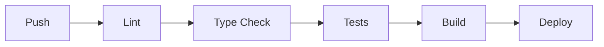

# Development Workflows (Next.js)

## Git Branching Strategy

Use GitHub Flow with short-lived branches:

```text
feature/<description>
bugfix/<description>
refactor/<description>
docs/<description>
```

## Commit Convention

Follow Conventional Commits:

```text
feat(scope): summary
fix(scope): summary
docs(scope): summary
```

## Pull Request Checklist

- [ ] Code follows Next.js conventions
- [ ] Tests added/updated
- [ ] No TypeScript errors
- [ ] No lint errors (`next lint`)
- [ ] No security issues (`npm audit`)
- [ ] A11y checked (automated + manual keyboard)

## CI/CD Pipeline (Suggested)



## Local Development

```bash
npm run dev
npm run lint
npm run type-check
npm run test
```

## Deployment

- **Preview**: per-PR deployments
- **Staging**: main branch auto-deploy
- **Production**: manual promotion or protected branch
