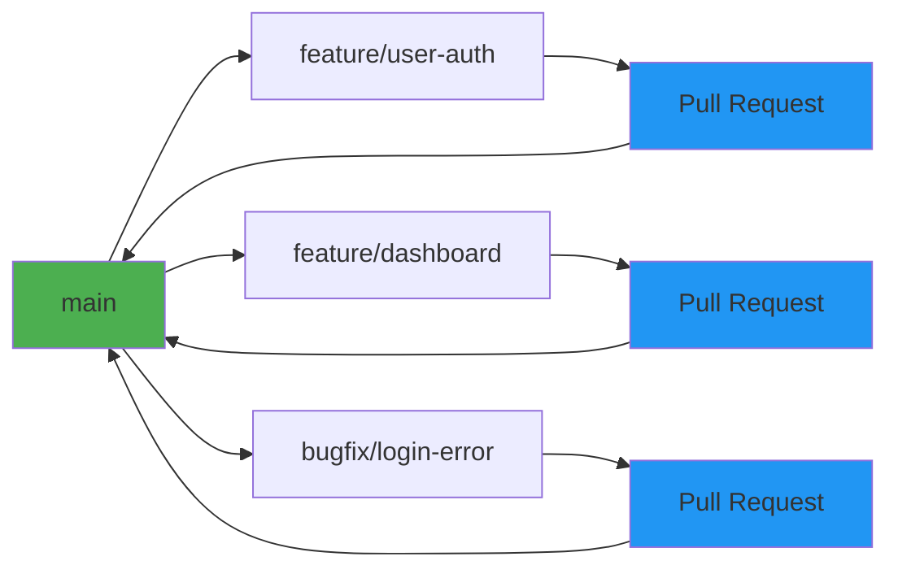

# Development Workflows

## Git Branching Strategy

### Main Branch Strategy

We use a **GitHub Flow** approach with main branches and feature branches:



### Branch Naming Conventions

```
<type>/<description>

Types:
- feature/    - New features
- bugfix/     - Bug fixes
- hotfix/     - Critical production fixes
- refactor/   - Code refactoring
- docs/       - Documentation updates
- test/       - Adding/updating tests
- perf/       - Performance improvements
- a11y/       - Accessibility improvements
```

**Examples:**
- `feature/user-authentication`
- `bugfix/memory-leak-in-chart`
- `hotfix/critical-xss-vulnerability`
- `refactor/extract-api-service`
- `docs/update-installation-guide`

### Branch Lifecycle

1. **Create branch from main**
   ```bash
   git checkout main
   git pull origin main
   git checkout -b feature/my-feature
   ```

2. **Make commits** (see Commit Convention)
   ```bash
   git add .
   git commit -m "feat: add user login component"
   ```

3. **Push and create PR**
   ```bash
   git push -u origin feature/my-feature
   # Create PR on GitHub/GitLab
   ```

4. **Merge after review and CI passes**

5. **Delete branch** (auto-deleted after merge)

## Commit Convention

### Conventional Commits

Follow the [Conventional Commits](https://www.conventionalcommits.org/) specification:

```
<type>(<scope>): <subject>

<body>

<footer>
```

### Types

- `feat:` - New feature
- `fix:` - Bug fix
- `docs:` - Documentation only
- `style:` - Code style changes (formatting, etc.)
- `refactor:` - Code refactoring
- `perf:` - Performance improvement
- `test:` - Adding/updating tests
- `chore:` - Maintenance tasks
- `ci:` - CI/CD changes
- `build:` - Build system changes
- `a11y:` - Accessibility improvements
- `security:` - Security fixes

### Scope (Optional)

- `button`, `modal`, `api`, `auth`, etc.

### Examples

```
feat(button): add loading state to primary button

Add spinner animation when button is in loading state.
Uses Heroicons Spinner component for consistency.

Closes #123

---
refactor(api): extract API client to separate module

Improve code organization by moving API client logic
to services/api/client.ts for better maintainability.
```

## Pull Request Checklist

### Before Opening PR

- [ ] Code follows project style guidelines
- [ ] Self-reviewed code
- [ ] Tests added/updated and passing
- [ ] No TypeScript errors
- [ ] No linting errors
- [ ] No security vulnerabilities (Snyk scan passes)
- [ ] Accessibility tested (axe-core passes)
- [ ] Storybook stories added/updated
- [ ] Documentation updated if needed
- [ ] Commit messages follow convention

### PR Description Template

```markdown
## Description
Brief description of changes

## Type of Change
- [ ] Bug fix
- [ ] New feature
- [ ] Breaking change
- [ ] Documentation update

## Testing
- [ ] Unit tests added/updated
- [ ] Integration tests added/updated
- [ ] E2E tests added/updated
- [ ] Manual testing completed

## Screenshots (if applicable)

## Related Issues
Closes #[issue-number]

## Additional Notes
Any additional context or information
```

### Code Review Standards

**Review Focus Areas:**
1. Code quality and readability
2. Type safety and TypeScript usage
3. Component patterns and architecture
4. Performance implications
5. Accessibility compliance
6. Security considerations
7. Test coverage
8. Documentation

**Review Checklist:**
- [ ] Code follows React best practices
- [ ] Proper TypeScript types (no `any`)
- [ ] No unnecessary re-renders
- [ ] Accessible semantic HTML
- [ ] ARIA attributes used correctly
- [ ] No security vulnerabilities introduced
- [ ] Bundle size impact acceptable
- [ ] Test coverage adequate
- [ ] Code is maintainable and documented

## CI/CD Pipeline

### GitHub Actions Workflows

**CI Workflow** (`ci.yml`):
```yaml
name: CI

on: [push, pull_request]

jobs:
  test:
    runs-on: ubuntu-latest
    steps:
      - uses: actions/checkout@v4
      - uses: actions/setup-node@v4
        with:
          node-version: '20'
      - run: npm ci
      - run: npm run lint
      - run: npm run type-check
      - run: npm run test:ci
      - run: npm run build
```

**Security Workflow** (`security.yml`):
```yaml
name: Security Scan

on: [push, pull_request]

jobs:
  snyk:
    runs-on: ubuntu-latest
    steps:
      - uses: actions/checkout@v4
      - uses: snyk/actions/node@master
        env:
          SNYK_TOKEN: ${{ secrets.SNYK_TOKEN }}
        with:
          args: --severity-threshold=high
```

**A11y Workflow** (`a11y.yml`):
```yaml
name: Accessibility

on: [pull_request]

jobs:
  test:
    runs-on: ubuntu-latest
    steps:
      - uses: actions/checkout@v4
      - uses: actions/setup-node@v4
      - run: npm ci
      - run: npm run test:a11y
      - uses: pa11y/pa11y-ci-action@v1
```

### GitLab CI Configuration

**`.gitlab-ci.yml`**:
```yaml
stages:
  - lint
  - test
  - security
  - build

lint:
  stage: lint
  script:
    - npm ci
    - npm run lint
    - npm run type-check

test:
  stage: test
  script:
    - npm ci
    - npm run test:ci -- --coverage
  coverage: '/(?<statements>\d+\.\d+%) covered/'

security:
  stage: security
  script:
    - snyk test --severity-threshold=high

build:
  stage: build
  script:
    - npm ci
    - npm run build
  artifacts:
    paths:
      - dist/
```

## Release Process

### Semantic Versioning

Follow [SemVer](https://semver.org/): `MAJOR.MINOR.PATCH`

- **MAJOR**: Breaking changes
- **MINOR**: New features (backward compatible)
- **PATCH**: Bug fixes (backward compatible)

### Release Workflow

1. **Prepare release branch**
   ```bash
   git checkout main
   git pull origin main
   git checkout -b release/v1.2.0
   ```

2. **Update version**
   ```bash
   npm version minor  # or patch, major
   # This updates package.json and creates a commit
   ```

3. **Create release PR**
   - Merge to main
   - CI/CD runs full test suite

4. **Tag release**
   ```bash
   git tag v1.2.0
   git push origin v1.2.0
   ```

5. **GitHub/GitLab release**
   - Create release from tag
   - Add release notes
   - Publish

### Release Notes

Generate from commit messages:
```bash
npm run release
# Creates CHANGELOG.md from conventional commits
```

Template:
```markdown
# v1.2.0 (2025-01-15)

## Features
- feat(button): add loading state to primary button (#123)
- feat(modal): support focus trap for accessibility (#456)

## Bug Fixes
- fix(chart): resolve memory leak in data updates (#789)

## Documentation
- docs: update installation guide (#012)
```

## Hotfix Process

### When to Create Hotfix

- Critical production bug
- Security vulnerability
- Data corruption issue

### Hotfix Workflow

1. **Create hotfix branch from production tag**
   ```bash
   git checkout -b hotfix/critical-xss main
   ```

2. **Make fix and commit**
   ```bash
   git commit -m "fix(security): patch XSS vulnerability in form input"
   ```

3. **Test thoroughly**
   - Manual testing
   - Regression testing
   - Security testing

4. **Merge to main and production**
   ```bash
   git checkout main
   git merge hotfix/critical-xss
   git checkout production
   git merge main
   ```

5. **Tag release**
   ```bash
   npm version patch
   git tag v1.2.1
   ```

6. **Deploy immediately**

## Development Environment

### Local Setup

1. **Clone repository**
   ```bash
   git clone <repo-url>
   cd <project>
   ```

2. **Install dependencies**
   ```bash
   npm install
   ```

3. **Set up environment variables**
   ```bash
   cp .env.example .env.development
   # Edit .env.development with your values
   ```

4. **Start development server**
   ```bash
   npm run dev
   ```

### IDE Setup

**VS Code Extensions:**
- ESLint
- Prettier
- TypeScript
- Vite
- ES7+ React/Redux/React-Native snippets
- Error Lens
- Thunder Client (API testing)

**Recommended Settings** (`.vscode/settings.json`):
```json
{
  "editor.formatOnSave": true,
  "editor.defaultFormatter": "esbenp.prettier-vscode",
  "editor.codeActionsOnSave": {
    "source.fixAll.eslint": true
  },
  "typescript.tsdk": "node_modules/typescript/lib"
}
```

## Quality Gates

### Pre-commit Hooks

Using Husky for git hooks:
```bash
# Install husky
npm install --save-dev husky

# Initialize husky
npx husky init
```

**`.husky/pre-commit`**:
```bash
#!/usr/bin/env sh
. "$(dirname -- "$0")/_/husky.sh"

npm run lint-staged
npm run type-check
```

**`lint-staged` in `package.json`**:
```json
{
  "lint-staged": {
    "*.{ts,tsx}": [
      "eslint --fix",
      "prettier --write"
    ]
  }
}
```

### Quality Thresholds

CI/CD will fail if:
- ❌ Lint errors exist
- ❌ Type errors exist
- ❌ Test coverage < 80%
- ❌ Security vulnerabilities detected
- ❌ Accessibility violations found
- ❌ Build fails
- ❌ Bundle size exceeds budget

## Deployment

### Environments

1. **Development** - `dev` branch, auto-deploy on push
2. **Staging** - `main` branch, deploy on PR merge
3. **Production** - Manual deployment, requires approval

### Deployment Checklist

Before deploying to production:
- [ ] All tests passing in CI
- [ ] Security scan passes
- [ ] QA sign-off
- [ ] Product owner approval
- [ ] Monitoring and rollback plan ready
- [ ] Release notes prepared

### Rollback Procedure

```bash
# Quick rollback
git revert <commit-hash>
git push origin main

# Deploy previous version
npm run deploy:production
```

## Collaboration Guidelines

### Pair Programming

When pairing:
- Driver/Navigator pattern
- Regular context switching
- Use screen sharing tools
- Document decisions in ADRs

### Code Ownership

- **Individual PRs**: PR author owns the code
- **After merge**: Team owns the code
- **No code ownership**: Anyone can refactor anyone's code
- **Ping when unsure**: Ask before major refactoring

### Communication

- Slack/Discord for async communication
- PR comments for code discussion
- ADRs for architectural decisions
- Team meetings for planning

