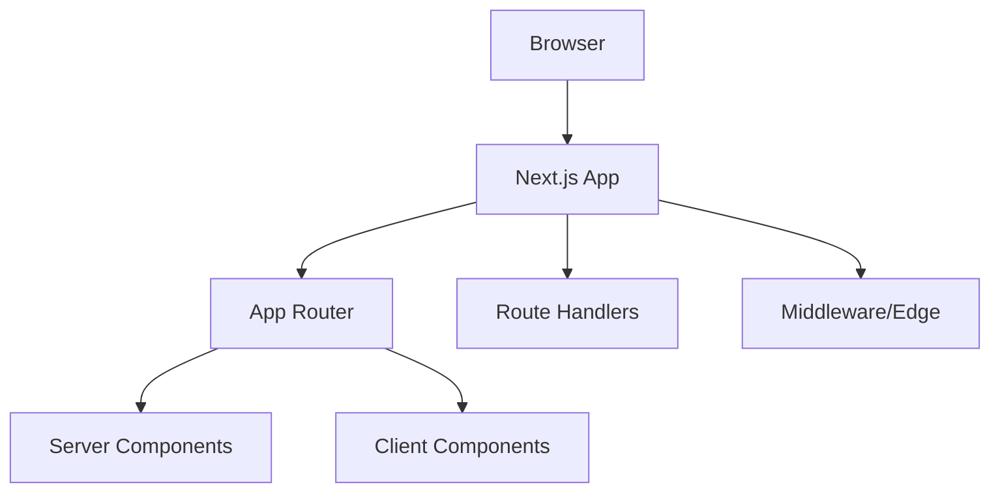

# Architecture Documentation

> **Note**: This document provides a high-level Next.js architecture overview. For detailed patterns and AI context, see [.context/architecture.md](.context/architecture.md).

## Overview

This configuration targets **Next.js (latest)** with App Router as the default. It supports SSR, SSG, ISR, API/BFF routes, and hybrid rendering with partial hydration.

## System Architecture

## Key Domains

- **App Router**: Server-first rendering and streaming UI
- **Pages Router**: Legacy route support when required
- **Route Handlers**: API/BFF endpoints with server-only logic
- **Middleware/Edge**: Auth, redirects, and request-time gating

## Data & Caching

- Server-side fetching with `fetch`
- ISR and on-demand revalidation
- Avoid client-side waterfalls

## Deployment

- Vercel (recommended)
- Node.js server
- Edge runtime where needed
- Static export for SSG-only sites
