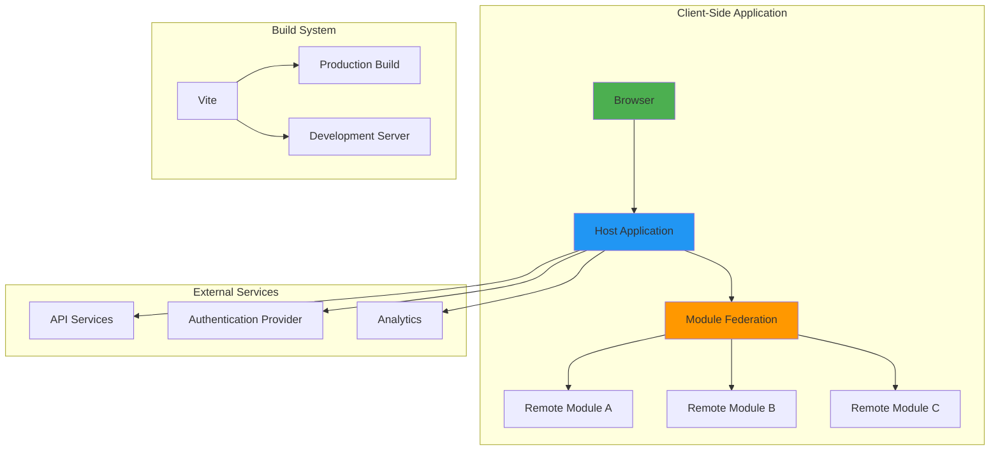

# Architecture Documentation

## Overview

This application is built with modern web technologies focusing on type safety, performance, accessibility, and maintainability.

## System Architecture

### High-Level Architecture



## Module Federation

### Architecture

**Host Application** (Main orchestrator)
- Port: 3000
- Responsibilities: Routing, auth, global UI
- Consumes remote modules dynamically

**Remote Modules** (Independent microapps)
- Ports: 3001, 3002, 3003...
- Responsibilities: Feature-specific functionality
- Expose components and utilities
- Can be deployed independently

### Module Sharing Strategy

**Shared Dependencies**
```typescript
shared: {
  'react': {
    singleton: true,
    requiredVersion: '^18.3.0',
    eager: false,
  },
  'react-dom': {
    singleton: true,
    requiredVersion: '^18.3.0',
    eager: false,
  },
}
```

## State Management

### Local State
- `useState` for simple component state
- `useReducer` for complex state logic

### Context API
- Theme preferences
- User authentication
- Global UI state (modals, notifications)

### External State (Optional)
- **Zustand** for complex global state
- **React Query** for server state

## Routing Architecture

### Client-Side Routing

Using React Router v6 with:
- Lazy loading for routes
- Protected route guards
- Route-based code splitting

```typescript
const routes = [
  { path: '/', element: <Home /> },
  { path: '/about', element: <About /> },
  { path: '/products/*', element: <ProductsRouter /> },
]
```

### Code Splitting

```typescript
const Products = lazy(() => import('./pages/Products'))

function App() {
  return (
    <Suspense fallback={<LoadingSpinner />}>
      <Routes>
        <Route path="/products" element={<Products />} />
      </Routes>
    </Suspense>
  )
}
```

## Component Architecture

### Component Hierarchy

```
App
├── Layout
│   ├── Header
│   ├── Navigation
│   └── Footer
├── Routes
│   ├── Home
│   ├── Products (Remote)
│   └── About
└── Providers
    ├── ThemeProvider
    ├── AuthProvider
    └── QueryProvider
```

### Component Patterns

**Container/Presentational Pattern**
```typescript
// Container: Handles logic
function UserProfileContainer() {
  const { user, loading, error } = useUser()
  return <UserProfile user={user} loading={loading} error={error} />
}

// Presentational: Handles UI
function UserProfile({ user, loading, error }) {
  if (loading) return <Spinner />
  if (error) return <ErrorMessage error={error} />
  return <div>{user.name}</div>
}
```

**Compound Components**
```typescript
<Card>
  <Card.Header>Title</Card.Header>
  <Card.Body>Content</Card.Body>
  <Card.Footer>Actions</Card.Footer>
</Card>
```

## API Integration

### API Client

```typescript
const apiClient = axios.create({
  baseURL: import.meta.env.VITE_API_URL,
  headers: { 'Content-Type': 'application/json' },
})

// Interceptors for auth, error handling
apiClient.interceptors.request.use(addAuthToken)
apiClient.interceptors.response.use(handleSuccess, handleError)
```

### Data Fetching

```typescript
// Custom hook for data fetching
export function useUser(userId: string) {
  return useQuery({
    queryKey: ['user', userId],
    queryFn: () => fetchUser(userId),
    staleTime: 5 * 60 * 1000,
  })
}
```

## Build Architecture

### Development

- **Vite Dev Server**: Fast HMR
- **TypeScript**: Incremental compilation
- **ESLint**: Real-time linting
- **Hot Module Replacement**: Instant updates

### Production

- **Optimized Build**: Tree-shaking, minification
- **Code Splitting**: Route-level and component-level
- **Asset Optimization**: Images, fonts, CSS
- **Source Maps**: For debugging production issues

### Bundle Strategy

```
app.js (< 200KB gzipped)
├── vendor chunk (React, ReactDOM)
├── router chunk
└── lazy loaded chunks (on-demand)
```

## Security Architecture

### Client-Side Security

- **Input Validation**: Sanitize all user inputs
- **XSS Prevention**: No `dangerouslySetInnerHTML`
- **HTTPS**: Enforced in production
- **CSP**: Content Security Policy headers
- **CORS**: Properly configured

### Dependency Security

- **Snyk Scanning**: Automated vulnerability detection
- **npm Audit**: Regular security audits
- **Dependency Updates**: Automated PRs for patches
- **License Compliance**: Check all dependencies

## Performance Architecture

### Optimization Strategies

**Code Splitting**
- Route-based splitting
- Component lazy loading
- Library chunk splitting

**Asset Optimization**
- Image optimization (WebP, AVIF)
- Font subsetting and preloading
- CSS minification

**Caching Strategy**
- Static assets: Long-term cache
- HTML: No cache
- API responses: Cache-Control headers

### Web Vitals Targets

- **LCP**: < 2.5s (Largest Contentful Paint)
- **FID**: < 100ms (First Input Delay)
- **CLS**: < 0.1 (Cumulative Layout Shift)
- **FCP**: < 1.8s (First Contentful Paint)
- **TBT**: < 200ms (Total Blocking Time)

## Testing Architecture

### Test Pyramid

```
         E2E Tests
        /          \
    Integration    \
   /                \
  Unit Tests      Component Tests
```

### Testing Strategy

- **Unit Tests**: Fast, isolated tests for utilities
- **Component Tests**: Test user interactions
- **Integration Tests**: Test component interactions
- **E2E Tests**: Test complete user journeys

### Coverage Targets

- Overall: >80%
- Critical paths: 100%
- Components: 100% of interactions

## Accessibility Architecture

### A11y Standards

- **WCAG 2.2 Level AA** compliance
- **Semantic HTML** mandatory
- **ARIA attributes** when needed
- **Keyboard navigation** for all interactive elements
- **Screen reader** testing required

### Testing Tools

- **axe-core**: Automated testing
- **Pa11y CI**: CI/CD integration
- **Keyboard navigation**: Manual testing
- **Screen readers**: VoiceOver, NVDA, JAWS

## Monitoring & Observability

### Error Tracking

- **Sentry**: Error monitoring
- **Production errors**: Automatic reporting
- **User feedback**: Integrated bug reports

### Performance Monitoring

- **Web Vitals**: Track Core Web Vitals
- **RUM**: Real User Monitoring
- **Performance budgets**: Bundle size limits

### Analytics

- **User interactions**: Track key events
- **Performance metrics**: Track load times
- **Business metrics**: Track conversions

## Deployment Architecture

### Environments

1. **Development** (localhost:3000)
   - Hot reload
   - Dev tools enabled
   - Mock data

2. **Staging** (staging.example.com)
   - Production build
   - Test data
   - Staging API

3. **Production** (www.example.com)
   - Optimized build
   - Production API
   - CDN delivery

### CI/CD Pipeline


## Dependencies

### Core Dependencies

- React 18.3+
- React DOM 18.3+
- React Router 6+
- TypeScript 5.5+

### Build Tools

- Vite 5+
- Module Federation
- ESLint
- Prettier

### Testing

- Vitest
- Testing Library
- Playwright
- Storybook

## Module Boundaries

### Clear Separation

Each module should:
- Have a single responsibility
- Encapsulate its implementation
- Expose a clear public API
- Be independently testable
- Have minimal coupling with other modules

### Module Communication

- **Props**: Parent → Child
- **Events**: Child → Parent
- **Context**: Global state
- **Module Federation**: Remote module integration

## Scalability Considerations

### Horizontal Scaling

- Stateless components
- No server-side session storage
- CDN for static assets
- Load balancing ready

### Performance at Scale

- Code splitting for large apps
- Virtualization for long lists
- Memoization for expensive computations
- Lazy loading for heavy components

## Additional Documentation

- [Contributing Guide](CONTRIBUTING.md)
- [Design System](.context/design-system.md)
- [Workflows](.context/workflows.md)
- [Code Conventions](.context/conventions.md)
- [Technology Stack](.context/stack.md)

